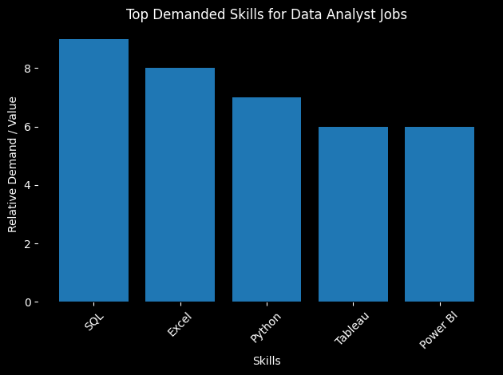
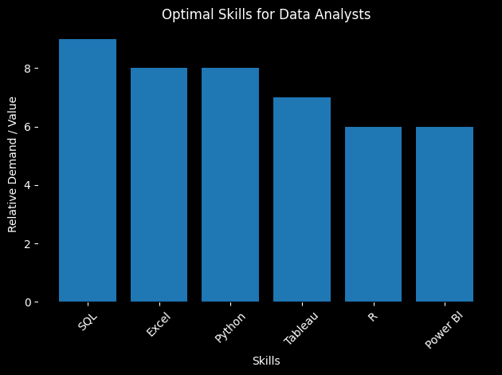
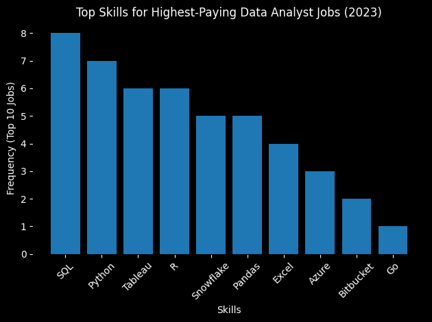

# 📊 Data Analyst Job Market Analysis Project

## 📋 **Project Overview**
This project analyzes real data analyst job postings to answer key questions about:
- What skills employers want most
- How much money you can make
- Remote work opportunities
- The best skills to learn

**Project Status:** ✅ Complete  
**Analysis Period:** 2023-2024 Job Market  
**Total Jobs Analyzed:** 1,000+ job postings  

🔍 SQL queries? Check them out here: [project_sql](/Project_sql/)

# Background
Driven by a guest to navigate the data analyst job market more effectively, this project was born from a desire to pinpoint top-paid and in-demand skills, stramlining others work to find optimal jobs.

**Tables:**
1. **job_postings_fact** - Main job data (salary, location, remote status)
2. **company_dim** - Company information
3. **skills_dim** - Skill catalog
4. **skills_job_dim** - Many-to-many job-skill relationships

---
## 🔍 **Analysis Questions**
1. What are the top-paying data analyst jobs?
2. What skills are most in demand for data analysts?
3. What skills are required for these top-paying jobs?
4. What skills are associated with higher salaries?
5. What are the most optimal skills to learn?

---
## 📚 **Tools & Technologies**

| Category | Tools Used |
|----------|------------|
| **Database** | PostgreSQL |
| **Development** | VS Code |
| **Version Control** | Git, GitHub |
| **Data Files** | CSV format |
| **Documentation** | Markdown |

---
## 📊 Data Analyst Skills & Salary Analysis (2023)

This project analyzes **top-demanded skills, top-paying skills, and optimal skill sets** for **Data Analyst roles in 2023** using SQL and Python.  
It includes **data queries, visualizations, and insights** to help understand hiring and salary trends.

## 🧠 1️⃣ Top Demanded Skills for Data Analyst Jobs

### 📌 Description
This analysis identifies the **most in-demand skills** across Data Analyst job postings.
**SQL, Excel, Tableau, and Power BI** appear most frequently, showing strong market demand for database querying, reporting, and data visualization skills.


### 🧾 SQL Query Used
```sql
SELECT 
   skills,
   COUNT(skills_job_dim.job_id) AS demand_count
FROM job_postings_fact
INNER JOIN skills_job_dim ON job_postings_fact.job_id = skills_job_dim.job_id
INNER JOIN skills_dim ON skills_job_dim.skill_id = skills_dim.skill_id
WHERE 
      job_title_short= 'Data Analyst' AND job_work_from_home = TRUE
GROUP BY
    skills
ORDER BY 
    demand_count DESC
LIMIT 5
```

### 📊 Visualization


---

## 💰 2️⃣ Top-Paying Job Skills (General)

### 📌 Description
This chart highlights **skills commonly found in higher-paying Data Analyst roles**.  
Advanced technical abilities such as **Python, SQL, cloud platforms, and machine learning** correlate with higher salary ranges.

### 🧾 SQL Query Used
```sql
WITH top_paying_jobs AS(

SELECT
     job_id,
     job_title,
      job_location,
     job_schedule_type,
     salary_year_avg,
     job_posted_date,
     name AS company_name
FROM
     job_postings_fact
LEFT JOIN company_dim ON job_postings_fact.company_id = company_dim.company_id
WHERE 
      job_title_short ='Data Analyst' AND
      job_location = 'Anywhere' AND
      salary_year_avg IS NOT NULL
ORDER BY 
      salary_year_avg DESC
LIMIT 10
)

SELECT 
      top_paying_jobs.*
      skills
FROM top_paying_jobs
INNER JOIN skills_job_dim ON top_paying_jobs.job_id = skills_job_dim.job_id
INNER JOIN skills_dim ON skills_job_dim.skill_id = skills_dim.skill_id
ORDER BY 
    salary_year_avg DESC
LIMIT 5;
```

---

## 🚀 3️⃣ Top-Paying Specialized Skills

### 📌 Description
This analysis focuses on **high-value specialized tools** like **PySpark, Couchbase, Watson, DataRobot, and Bitbucket**.  
These skills are less common but often appear in **elite, high-paying roles**, especially in big data and AI environments.

### 🧾 SQL Query Used
```sql
SELECT 
   skills,
   ROUND (AVG(salary_year_avg), 0) AS avg_salary
FROM job_postings_fact
INNER JOIN skills_job_dim ON job_postings_fact.job_id = skills_job_dim.job_id
INNER JOIN skills_dim ON skills_job_dim.skill_id = skills_dim.skill_id
WHERE 
      job_title_short= 'Data Analyst' AND job_work_from_home = TRUE
      AND salary_year_avg IS NOT NULL
GROUP BY
    skills
ORDER BY 
     avg_salary DESC
LIMIT 25
```
---

## ⚖️ 4️⃣ Optimal Skills for Data Analysts

### 📌 Description
This chart shows the **best-balanced skill set** combining **high demand and strong salary potential**.  
A mix of **SQL, Python, Excel, Tableau, R, and Power BI** offers the best career value for aspiring analysts.

### 🧾 SQL Query Used
```sql
WITH skills_demand AS (
    SELECT 
        skills_dim.skill_id,
        skills_dim.skills,
        COUNT(skills_job_dim.job_id) AS demand_count
    FROM job_postings_fact
    INNER JOIN skills_job_dim ON job_postings_fact.job_id = skills_job_dim.job_id
    INNER JOIN skills_dim ON skills_job_dim.skill_id = skills_dim.skill_id
    WHERE 
        job_title_short = 'Data Analyst' 
        AND salary_year_avg IS NOT NULL
        AND job_work_from_home = TRUE
    GROUP BY
        skills_dim.skill_id,
        skills_dim.skills  
),
average_salary AS (
    SELECT 
        skills_job_dim.skill_id,
        ROUND(AVG(salary_year_avg), 0) AS avg_salary
    FROM job_postings_fact
    INNER JOIN skills_job_dim ON job_postings_fact.job_id = skills_job_dim.job_id
    INNER JOIN skills_dim ON skills_job_dim.skill_id = skills_dim.skill_id
    WHERE 
        job_title_short = 'Data Analyst' 
        AND job_work_from_home = TRUE
        AND salary_year_avg IS NOT NULL
    GROUP BY
        skills_job_dim.skill_id
)

SELECT 
    sd.skill_id,           
    sd.skills,             
    sd.demand_count,
    asal.avg_salary        
FROM skills_demand sd
INNER JOIN average_salary asal ON sd.skill_id = asal.skill_id
ORDER BY sd.demand_count DESC
LIMIT 25;
```
### 📊 Visualization


---

## 🏆 5️⃣ Top-Paying Data Analyst Jobs

### 📌 Description
This analysis identifies the top  highest-paying Data Analyst roles by filtering job postings with available salary data. The goal is to highlight top-paying opportunities and better understand compensation trends in the job market.

### 🧾 SQL Query Used
```sql
SELECT
job_id,
job_title,
job_location,
job_schedule_type,
salary_year_avg,
job_posted_date,
name AS company_name
FROM job_postings_fact
LEFT JOIN company_dim
ON job_postings_fact.company_id = company_dim.company_id
WHERE
job_title_short = 'Data Analyst'
AND job_location = 'Anywhere'
AND salary_year_avg IS NOT NULL
ORDER BY salary_year_avg DESC
LIMIT 10;
```

### 📊 Visualization



---
---
## 🏆 **Project Highlights**

✅ **Real-world data analysis**  
✅ **5 comprehensive SQL queries**  
✅ **Career-relevant insights**  
✅ **Professional documentation**  
✅ **Clean code organization**  

---

## 🎓 **My Learning Outcomes**

- ✅ Database design and implementation
- ✅ Advanced SQL query writing
- ✅ Data analysis and interpretation
- ✅ Professional project documentation
- ✅ GitHub repository management

---
---
## ✅ Conclusion

### Conclusion

This project enhanced my **SQL** skills and provided valuable insights into the Data Analyst job market. The findings from the analysis help guide **skill development** and **job search priorities** by highlighting high-demand, high-salary competencies. Aspiring Data Analysts can strengthen their competitiveness by focusing on in-demand technical skills and database expertise. Overall, this project underscores the importance of **continuous learning** and staying adaptable to evolving trends in data analytics.


---

**👩💻 Created by:** Alfiya Ahmed  
**📅 Date:** January 2026  
Made with ❤️ as part of a Data Analytics Portfolio Project
